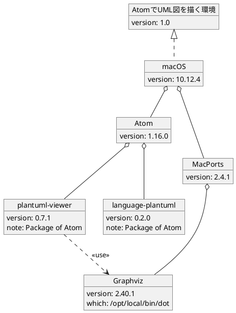

# AtomでUML図を描く

## 概要

表計算ソフトで図を描くのに疲れたのと、図をバージョン管理するのが微妙だったのですが、AtomとPlantUMLがこの問題を解決してくれそうな気がしてます。

テキストであればバージョン管理との親和性も良いですね。

- Atom([https://atom.io/](https://atom.io/)):  
  素晴らしいエディタです。これ以上の説明はいらないでしょう。  
- PlantUML([http://plantuml.com/](http://plantuml.com/)):  
  テキストからUML図を生成するツールです。専用の言語でUMLを書くことになりますが、シンプルなので学習コストは高くありません。

PlantUMLは実行可能JARファイルでも提供されているため、テキストから図を生成することは簡単に試せます。  
また、PlantUMLの公式サイトでは入力されたテキストから動的に図を生成するサンプルが動作するため、とりあえずPlantUMLに触ることも簡単です。  

## Installation

私の環境(ソフトウェア)は以下の通りです。

```yaml
- macOS: 10.12.4
  software:
    - Atom: 1.16.0
      packages:
        - plantuml-viewer: 0.7.1
        - language-plantuml: 0.2.0
    - MacPorts: 2.4.1
      ports:
        - Graphviz: 2.40.1_1
```

Atomのpackgeのplantuml-viewerが "AtomでUML図を描く" をすべてやってくれます。最高のpackageです。language-plantumlは _.plantuml_ ファイルをSyntax highlightingしてくれます。便利なpackageです。

Windowsでも同様の環境を構築してPlantUMLできますが、手元に環境がないため詳細を書けません。

### MacPorts and ports

MacPortsはmacOS用のパッケージ管理システムです。今回はPlantUMLに図を描画させるためにGraphvizが必要なので、これでGraphvizをインストールします。

MacPortsは [https://www.macports.org/](https://www.macports.org/) からダウンロードできます。ダウンロードしたインストーラを実行します。これで `port` コマンドが使えるようになります。

Graphvizは次のコマンドでインストールします。これで `dot` コマンドが使えるようになります。

```
$ sudo port install graphviz
...
$ which dot
/opt/local/bin/dot
```

### Atom and packages

Atomは素晴らしいエディタです。これでplantumlを書きます。

Atomは [https://atom.io/](https://atom.io/) からダウンロードできます。私はダウンロードしたZIPを解凍して `/Applications` に設置してます。

packagesはAtomのメニューの `Atom > Preferences... ⌘,` からの `Settings > Install` でpackage毎に検索してインストールします。

plantuml-viewerのSettingsの `Graphviz Dot Executable` に `dot` のパス( `/opt/local/bin/dot` )を設定します。インストールしたpackageのSettingsはAtomのメニュー `Atom > Preferences... ⌘,` からの `Settings > Packages` の各packageのSettingsボタンで遷移できます。

## Demo

例として "AtomでUML図を描く環境" を描いてみました。plantumlの書き方は模索中です。(肝心のUML図に自信がないです...)

_.plantuml_ ファイルをAtomでオープンしてメニューの `Packages > PlantUML Viewer > Toggle View ^⌥P` を実行するか `ctrl-alt-p` で図のプレビューが表示されます。プレビューは _.plantuml_ を変更する度に更新されます。

**env.plantuml**



**env.png**


plantuml-viewerのpreviewを `Save As...` する際に、ファイル名に _.png_ を付けるとPNGイメージで保存できます。拡張子がない場合はEPSになるようです。(SVGも出力できます)

plantumlの基本的な書き方は公式サイトが参考になります。
